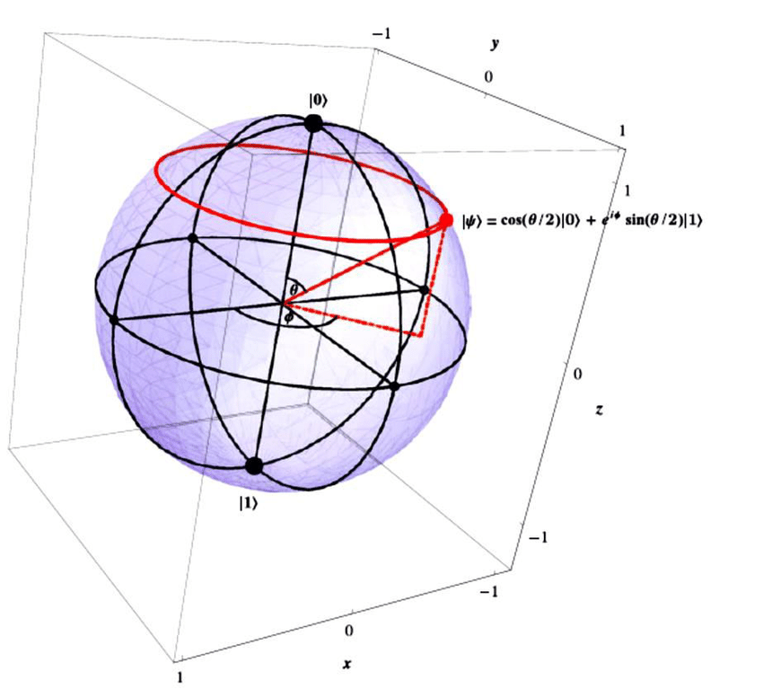
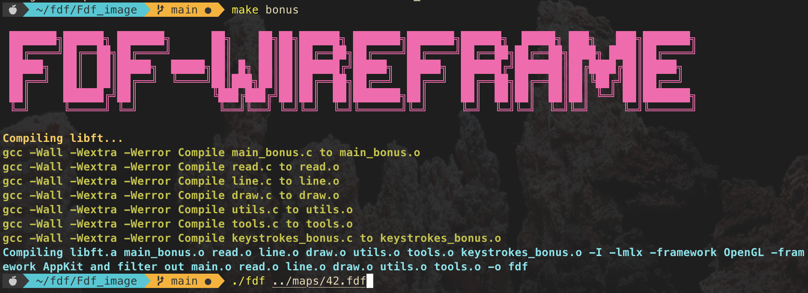
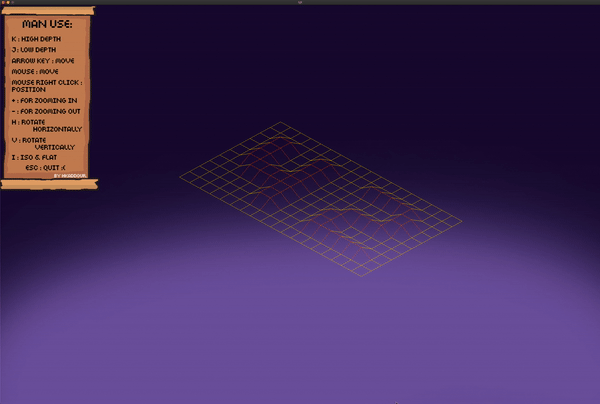

# Fdf Wireframe

> The project PDF:
```
https://cdn.intra.42.fr/pdf/pdf/48841/en.subject.pdf
```
### The idea of the project:
:wave: FDF it's a graphic project the purpose of is to draw pixels in mlx window based on the giving map coordinate. Now let's break down how we can do it first we have a file has different number sparate with spaces those are the coordinate so we have to read this map using `get next line` and allocate it in a 2d array of int so we can considrate as coordinate to draw on them, next step is to open a mlx window so you can draw on it `tutorial of mlx are down below`, next thing is to draw you have to come up with an algorithm to draw you can make yours or use a mathematic one like `DDA` or `Bresenham` you will draw based on the 2d array where the width is x and the height is y loop on the 2d array and every time put pixel between two point x the index and x + 1 and so on same thing on y and boom now you draw a flat model now next step is to make it 3d isometric use cosine for x and sine for y and z for depth.
Check down below for all the tutorial.

### Map file:
```
0  0  0  0  0  0  0  0  0  0  0  0  0  0  0  0  0  0  0
0  0  0  0  0  0  0  0  0  0  0  0  0  0  0  0  0  0  0
0  0 10 10  0  0 10 10  0  0  0 10 10 10 10 10  0  0  0
0  0 10 10  0  0 10 10  0  0  0  0  0  0  0 10 10  0  0
0  0 10 10  0  0 10 10  0  0  0  0  0  0  0 10 10  0  0
0  0 10 10 10 10 10 10  0  0  0  0 10 10 10 10  0  0  0
0  0  0 10 10 10 10 10  0  0  0 10 10  0  0  0  0  0  0
0  0  0  0  0  0 10 10  0  0  0 10 10  0  0  0  0  0  0
0  0  0  0  0  0 10 10  0  0  0 10 10 10 10 10 10  0  0
0  0  0  0  0  0  0  0  0  0  0  0  0  0  0  0  0  0  0
0  0  0  0  0  0  0  0  0  0  0  0  0  0  0  0  0  0  0
```

### Tutorials:
**A brief start for graphic:**

https://github.com/qst0/ft_libgfx

**Mlx source:**

https://qst0.github.io/ft_libgfx/
https://github.com/keuhdall/images_example#2-how-does-it-work-
https://github.com/VBrazhnik/FdF/wiki/How-to-create-linear-gradient%3F
https://gontjarow.github.io/MiniLibX/
https://github.com/VBrazhnik/FdF/wiki/How-to-draw-a-line%3F
https://harm-smits.github.io/42docs/libs/minilibx/getting_started.html
https://github.com/sejinpark12/MiniLibX_man_kor
https://coder-question.com/cq-blog/605260
https://velog.io/@dogfootbirdfoot/MiniLibX

**Draw algo:**

https://en.wikipedia.org/wiki/Bresenham%27s_line_algorithm
https://www.youtube.com/watch?v=RGB-wlatStc
https://www.geeksforgeeks.org/bresenhams-line-generation-algorithm/
https://www.youtube.com/watch?v=W5P8GlaEOSI
https://www.youtube.com/watch?v=Qyt1ccpm1hY&t=1s

**Makefile**

https://stackoverflow.com/questions/36719876/how-to-filter-out-files-with-multiple-criteria-in-a-makefile
https://superuser.com/questions/370575/how-to-run-make-file-from-any-directory

**Isometric:**

https://en.wikipedia.org/wiki/Isometric_projection#:~:text=Isometric%20projection%20is%20a%20method,of%20them%20is%20120%20degrees.
https://www.engineeringchoice.com/isometric-projection/
https://a5huynh.github.io/posts/2019/isometric-rotation/
https://clintbellanger.net/articles/isometric_math/
https://andrewharvey4.wordpress.com/2008/11/15/the-mathematics-behind-graphical-drawing-projections-in-technical-drawing/
https://www.youtube.com/watch?v=bSM7RNSbWhM
https://www.youtube.com/watch?v=mhd9FXYdf4s
https://www.youtube.com/watch?v=cgPYLJ-s5II
https://www.youtube.com/watch?v=RWJsy9ufxtc&t=3s
https://stackoverflow.com/questions/28607713/convert-3d-coordinates-to-2d-in-an-isometric-projection



### For use:
Clone this repo then cd to either `Fdf_image` or `Fdf_pixel`.
```
make or make bonus
./fdf ../maps/42.fdf
```
Try other maps like mars and fractol.

### Imgaes:



**ISO**


**Flat**


**Thank you for reading, y'all have a good one :rocket:.**
